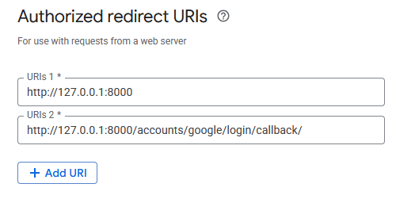
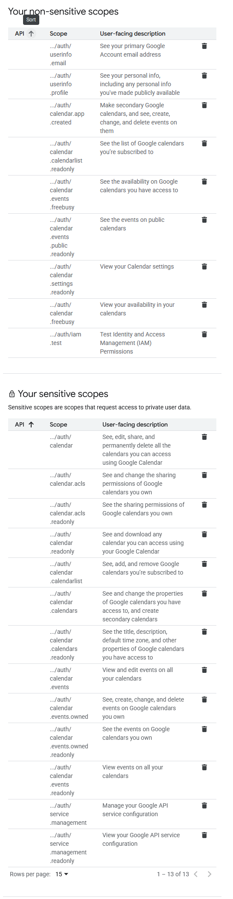
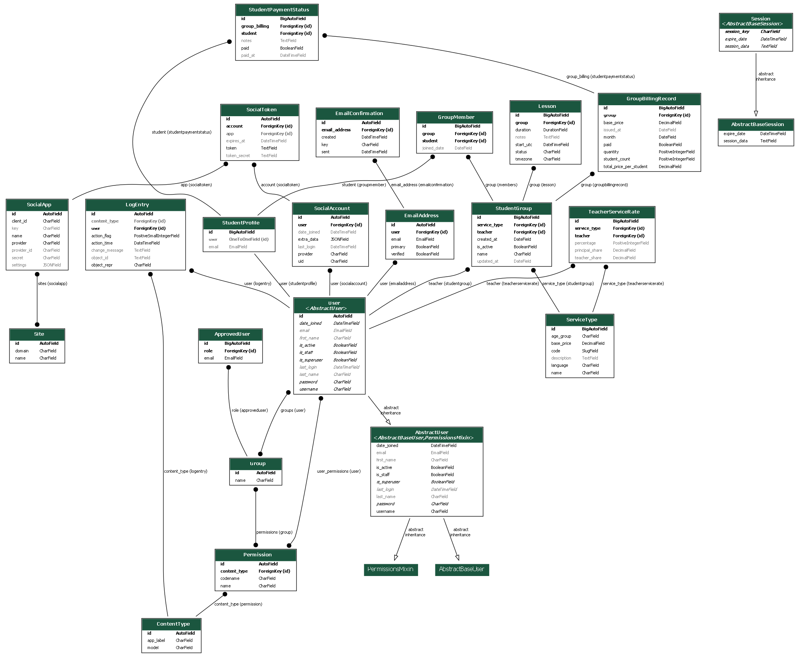

# CRM App for Small Language School Management

A Custom CRM application designed to manage a small language school, focusing on automatic management of 
lessons(events) from Google calendar, billing, revenue tracking, and notifications via Telegram.

## Features

- Role-based access control (Student, Teacher, Principal)
- Automatic lesson matching with Google Calendar
- Billing and revenue tracking
- Telegram integration for invoices (billing) and notifications

## Stack
- Django + PostgreSQL (currently using SQLite for development)
- Django Allauth for authentication and Google Authentication Integration
- Google API for Calendar integration
- Frontend: (_to be decided, possibly vanilla JS or React_)
- Telegram Bot API for notifications and billing (_to be decided_)


## Installation
_*This might not be the fully correct process, needs to be edited_

1. Clone the repository:  
   ```bash
   git clone https://github.com/oleksharh/crm-app.git
   cd crm-app
   ```
   
2. Install dependencies:  
   ```bash
   pip install -r requirements.txt
   ```
   
3. Make migrations and migrate the database:<br>
_*Make sure to be in src directory when running this_
   ```bash
   python manage.py makemigrations
   python manage.py migrate
   ```
   
4. Create a superuser (admin):
   _*This is necessary to access the Django Admin interface in order to set up a social app_
   ```bash
    python manage.py createsuperuser
    ```
   
5. Run the development server:
    ```bash
    python manage.py runserver
    ```
   
6. Access the application under localhost:8000 in your web browser.

## Configuration

1. Set up Google Calendar API:
   - Create a project in the [Google Developer Console](https://console.developers.google.com/).
   - Enable the Google Calendar API.
   - Create OAuth 2.0 credentials and download the JSON file.
   - For now, we will manually copy the credentials to configure the application.
   
2. Configure the Google client in Google Cloud:<br>
   **Authorized redirect URIs** (copy and paste each one into Google Cloud Project):  
   <br>
   ```
   http://127.0.0.1:8000 
   http://127.0.0.1:8000/accounts/google/login/callback/
   ```

3. Go to Admin Panel and configure as follows:
   - Change the site that previously was called "example.com" to domain: http://127.0.0.1:8000
   - Create a new Social Application for Google OAuth2:
     - insert your client ID and secret from the JSON file downloaded in step 1
     - and from sites, select the site you just created with this domain http://127.0.0.1:8000
     
4. Configure Google Scopes in Google Cloud console:<br>
   _* Scopes are located in Data Access tab_
   - Add the following scopes:<br>
     <br>
   Note: Not all scopes are required in the current version, but they are added for future use.
   When publishing your application, you will need to add the scopes that you use in your application and undergo
   the Google verification process. Choice of scopes needs to be justified to Google to have your app approved.

5. Don't forget to add test users in Google Cloud Console to be able to test the application with your accounts.

## Setting up the School (Data Population)
1. Manually add email address of a principal in the database in the admin panel in the Approved User model.
2. Principal will subsequently be able to add teachers and students.
3. Students do not need to be manually approved. When a student group is created, their emails are automatically
whitelisted (this is partially implemented). Alternatively, students can sign up themselves.
You can assign roles to them manually through the Django shell. A user-facing interface for
role assignment will be added later.
4. Any questions or issues, please create an issue in the repository.<br>



## Contributing
If you want to contribute to the project, please follow these steps:
1. Please fork the repository from: [https://github.com/oleksharh/crm-app](https://github.com/oleksharh/crm-app)
2. Create a new branch for your feature or bug fix.
3. Make your changes and commit them with clear messages.
4. Push your changes to your forked repository.
5. Create a pull request with a clear description of your changes and why they should be merged.
